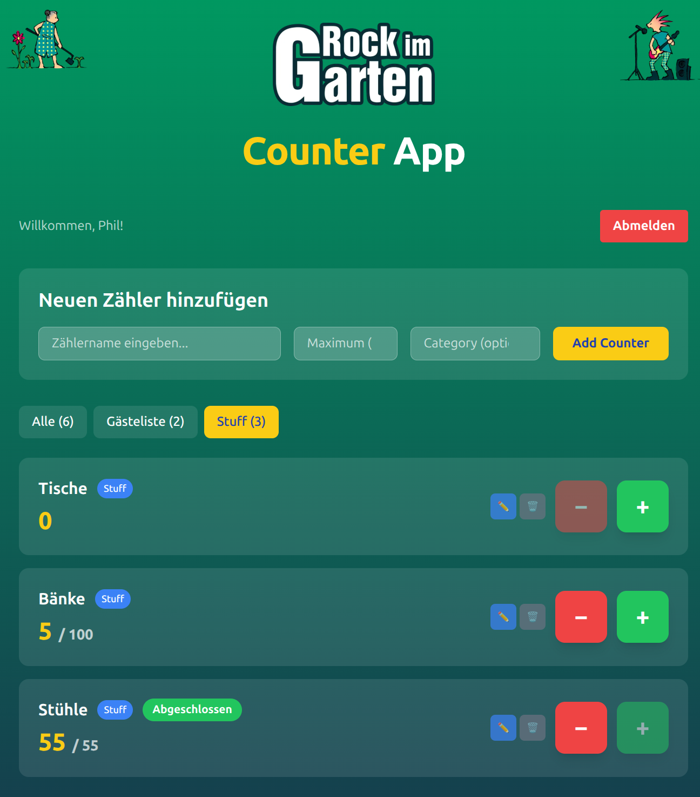
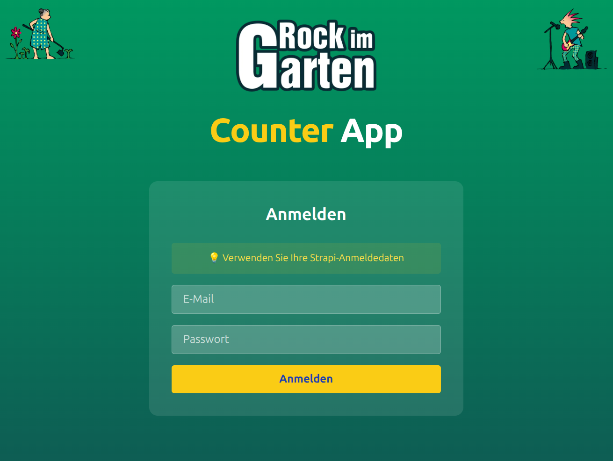

# Counter App

A modern counter management application built with Next.js 15, TypeScript, and Tailwind CSS. Create, manage, and track multiple counters with categories, maximums, and persistent storage via Strapi API.

📝 **[Development Journey](chat.md)** - View the complete development conversation and feature evolution

> **Note:** The user prompts in the development documentation are simplified summaries. All detailed technical input, complex instructions, and specific implementation details have been condensed for readability.


## 📷 Screenshots


*Main counter interface with category tabs and counter management*


*Authentication login screen*

## ✨ Features

- 🔢 **Multiple Counters** - Create unlimited custom counters
- 📊 **Progress Tracking** - Set optional maximum values with completion status
- 🏷️ **Categories** - Organize counters with custom categories and filtering
- ✏️ **Inline Editing** - Edit counter names, maximums, and categories directly
- 💾 **Persistent Storage** - Data saved via Strapi API backend
- 🌐 **German Interface** - Fully localized German user interface
- 📱 **Responsive Design** - Works on desktop, tablet, and mobile
- 🎨 **Modern UI** - Beautiful gradient backgrounds and smooth animations

## 🚀 Getting Started

### Prerequisites

- Node.js 22.22.0 (LTS)
- npm 10.9.4 or higher

### Installation

1. Clone the repository:
```bash
git clone https://github.com/rockimgarten/counter-app.git
cd counter-app
```

2. Install dependencies:
```bash
npm install
```

3. Set up environment variables:
```bash
cp .env.example .env.local
# Edit .env.local with your Strapi backend URLs
```

4. Run the development server:
```bash
npm run dev
```

4. Open [http://localhost:3000](http://localhost:3000) in your browser.

## 🛠️ Tech Stack

- **Frontend**: [Next.js 15](https://nextjs.org/) with App Router
- **Language**: [TypeScript 5](https://www.typescriptlang.org/)
- **Styling**: [Tailwind CSS 3.4.1](https://tailwindcss.com/)
- **UI Framework**: [React 19](https://reactjs.org/)
- **Backend API**: [Strapi](https://strapi.io/) (hosted on Render)
- **Deployment**: [Vercel](https://vercel.com/) (recommended)

## 📖 Usage

### Creating Counters
1. Enter a counter name in the input field
2. Optionally set a maximum value for progress tracking
3. Optionally assign a category for organization
4. Click "Zähler hinzufügen" to create the counter

### Managing Counters
- **Increment/Decrement**: Use the large + and - buttons
- **Edit**: Click the pencil icon (✏️) to modify name, max, or category
- **Delete**: Click the trash icon (🗑️) to remove a counter
- **Filter**: Use category tabs to filter counters by category

### Categories
- Auto-complete suggestions from existing categories
- Filter counters by category using the tab navigation
- Counter counts shown in parentheses for each category

## 📦 Available Scripts

```bash
npm run dev      # Start development server
npm run build    # Build for production
npm start        # Start production server
npm run lint     # Run ESLint
```

## 🚀 Deployment

### Deploy on Vercel (Recommended)

1. Push your code to GitHub
2. Go to [vercel.com](https://vercel.com) and sign up
3. Import your GitHub repository
4. Deploy automatically with zero configuration